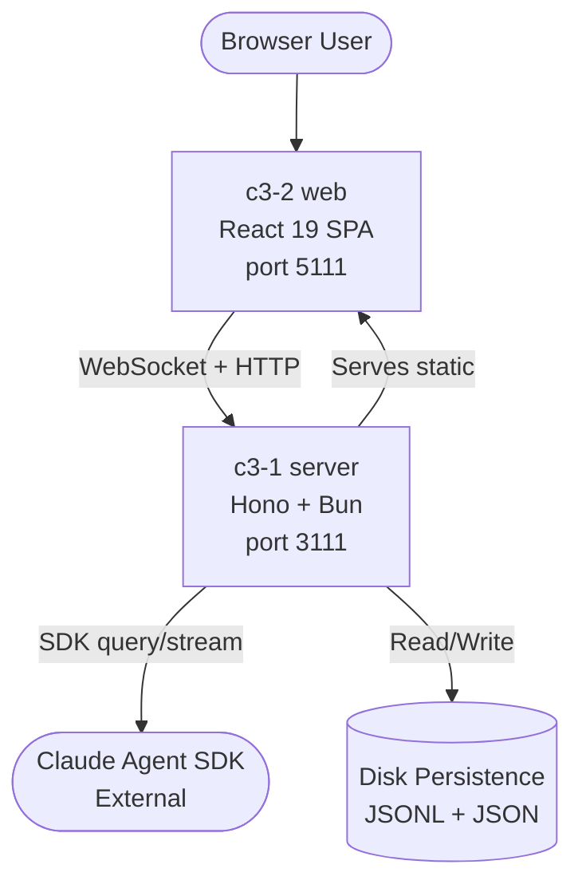

# Claude Web

## Goal

Provide a browser-based interface for managing interactive Claude coding sessions via the Claude Agent SDK.

## Overview

## Abstract Constraints

| Constraint | Rationale | Affected Containers |
|------------|-----------|---------------------|
| Real-time bidirectional communication | Sessions must stream SDK messages instantly to the browser and relay user responses back | c3-1-server, c3-2-web |
| Session lifecycle persistence | Sessions must survive server restarts; metadata and messages persisted to disk | c3-1-server |
| Permission delegation to browser | SDK permission prompts and AskUserQuestion must be forwarded to the UI and responses relayed back | c3-1-server, c3-2-web |
| Single-server deployment | Server hosts both API and static files; one process, one port | c3-1-server |

## External Systems

| Name | Role | Interface |
|------|------|-----------|
| Claude Agent SDK | AI agent runtime providing streaming conversation sessions | `@anthropic-ai/claude-agent-sdk` — `query()` returns async iterable of SDK messages |

## Containers

| ID | Name | Boundary | Status | Responsibilities | Goal Contribution |
|----|------|----------|--------|------------------|-------------------|
| c3-1 | [server](c3-1-server/README.md) | service | implemented | Session lifecycle, SDK orchestration, persistence, WebSocket broadcast, REST API | Bridges browser to Claude SDK; manages all server-side state and communication |
| c3-2 | [web](c3-2-web/README.md) | app | implemented | UI rendering, WebSocket client, data caching, user interaction handling | Provides the browser interface users interact with to manage Claude sessions |

## Linkages

| From | To | Mechanism | Purpose |
|------|----|-----------|---------|
| c3-2 web | c3-1 server | WebSocket (`/ws`) | Real-time bidirectional session messages, permissions, questions |
| c3-2 web | c3-1 server | HTTP REST (`/api/*`) | Session list, messages history, config, workspaces, commands |
| c3-1 server | Claude SDK | SDK `query()` | Creates and streams Claude coding sessions |
| c3-1 server | Disk | Filesystem | Persists session metadata (JSON) and messages (JSONL) |
