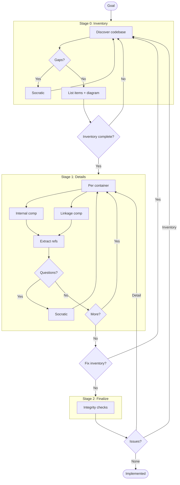
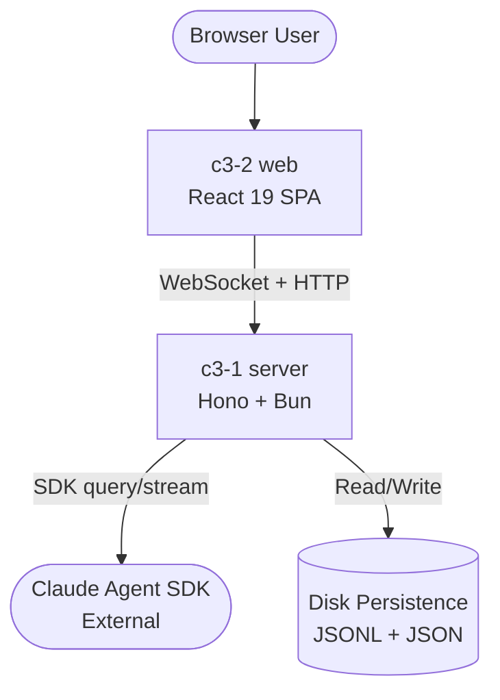

# C3 Architecture Documentation Adoption

## Goal

Adopt C3 methodology for Claude Web.

<!--
EXIT CRITERIA (all must be true to mark implemented):
- All containers documented with Goal Contribution
- All components documented with Container Connection
- Refs extracted for repeated patterns
- Integrity checks pass
- Audit passes
-->

## Workflow

---

## Stage 0: Inventory

### Context Discovery

| Arg | Value |
|-----|-------|
| PROJECT | Claude Web |
| GOAL | Provide a browser-based interface for managing interactive Claude coding sessions via the Claude Agent SDK |
| SUMMARY | Web UI that bridges browser clients to Claude Agent SDK through a WebSocket-based backend, enabling real-time session management, permission handling, and message streaming |

### Abstract Constraints

| Constraint | Rationale | Affected Containers |
|------------|-----------|---------------------|
| Real-time bidirectional communication | Sessions must stream SDK messages instantly to the browser and relay user responses back | c3-1-server, c3-2-web |
| Session lifecycle persistence | Sessions must survive server restarts; metadata and messages persisted to disk | c3-1-server |
| Permission delegation to browser | SDK permission prompts and AskUserQuestion must be forwarded to the UI and responses relayed back | c3-1-server, c3-2-web |
| Single-server deployment | Server hosts both API and static files; no separate CDN or load balancer | c3-1-server |

### Container Discovery

| N | CONTAINER_NAME | BOUNDARY | GOAL | SUMMARY |
|---|----------------|----------|------|---------|
| 1 | server | service | Bridge web clients to Claude Agent SDK via HTTP + WebSocket API | Hono+Bun backend managing sessions, permissions, persistence, and SDK orchestration |
| 2 | web | app | Provide real-time browser UI for Claude session interaction | React 19 SPA with WebSocket communication, message rendering, and session management |

### External Systems

| Name | Role | Interface |
|------|------|-----------|
| Claude Agent SDK | AI agent runtime | `@anthropic-ai/claude-agent-sdk` — `query()` creates streaming sessions |

### Component Discovery (Brief)

**c3-1-server (Foundation 01-09)**

| N | NN | COMPONENT_NAME | CATEGORY | GOAL | SUMMARY |
|---|----|----|----------|------|---------|
| 1 | 01 | config | foundation | Load and manage application configuration | Reads config.json, provides AppConfig; lists workspaces from baseDir |
| 1 | 02 | paths | foundation | Provide filesystem paths for config and data storage | XDG-compliant path resolution for config and data dirs |
| 1 | 03 | broadcast | foundation | Enable real-time message delivery to all WebSocket clients | BroadcastFn injected via preset, iterates connected clients |
| 1 | 04 | session-store | foundation | Manage in-memory active session state | Map<string, SessionState> with cleanup on scope disposal |
| 1 | 05 | sdk-factory | foundation | Abstract Claude SDK query creation | Factory wrapping SDK's query() for testability |
| 1 | 06 | persistence | foundation | Persist session metadata and messages to disk | JSONL message files + sessions.json index |

**c3-1-server (Feature 10+)**

| N | NN | COMPONENT_NAME | CATEGORY | GOAL | SUMMARY |
|---|----|----|----------|------|---------|
| 1 | 10 | session-lifecycle | feature | Create, resume, and kill Claude sessions | Manages SDK query lifecycle with permission handling and message loop |
| 1 | 11 | messaging | feature | Route user messages and permission responses to active sessions | send-message and respond-permission flows |
| 1 | 12 | api-surface | feature | Expose HTTP + WebSocket API for client communication | Hono routes for REST + Bun WebSocket handler dispatching to flows |

**c3-2-web (Foundation 01-09)**

| N | NN | COMPONENT_NAME | CATEGORY | GOAL | SUMMARY |
|---|----|----|----------|------|---------|
| 2 | 01 | websocket-client | foundation | Maintain persistent WebSocket connection and route server messages | useClaudeSocket hook with auto-reconnect and state management |
| 2 | 02 | data-layer | foundation | Provide data fetching and caching infrastructure | React Query hooks for sessions, workspaces, messages, config, commands |

**c3-2-web (Feature 10+)**

| N | NN | COMPONENT_NAME | CATEGORY | GOAL | SUMMARY |
|---|----|----|----------|------|---------|
| 2 | 10 | chat-view | feature | Render conversation messages in real-time | MessageRenderer dispatching SDK message types to specialized renderers |
| 2 | 11 | session-management | feature | Navigate and manage multiple sessions | SessionSidebar with active/ended session list and navigation |
| 2 | 12 | interaction-prompts | feature | Handle SDK permission and question prompts in the browser | PermissionPrompt + AskUser components with response callbacks |
| 2 | 13 | workspace-launcher | feature | Launch new sessions from workspace presets | PresetLauncher for workspace selection + QuickActions toolbar |
| 2 | 14 | settings | feature | Configure application settings | Settings component with config read/update via React Query mutations |

### Ref Discovery

| SLUG | TITLE | GOAL | Scope | Applies To |
|------|-------|------|-------|------------|
| atoms | Atom Pattern | Document the @pumped-fn/lite atom pattern for shared injectable state | server | c3-101 through c3-106 |
| flows | Flow Pattern | Document the @pumped-fn/lite flow pattern for typed business operations | server | c3-110, c3-111, c3-112 |
| industrial-brutalist | Industrial Brutalist Design | Document the UI design system conventions governing all web components | web | c3-210 through c3-214 |

### Overview Diagram

### Gate 0

- [x] Context args filled (PROJECT, GOAL, SUMMARY)
- [x] Abstract Constraints identified
- [x] All containers identified with args (including BOUNDARY)
- [x] All components identified (brief) with args and category
- [x] Cross-cutting refs identified
- [x] Overview diagram generated

---

## Stage 1: Details

### Container: c3-1-server

**Created:** [x] `.c3/c3-1-server/README.md`

| Type | Component ID | Name | Category | Doc Created |
|------|--------------|------|----------|-------------|
| Internal | c3-101 | config | foundation | [x] |
| Internal | c3-102 | paths | foundation | [x] |
| Internal | c3-103 | broadcast | foundation | [x] |
| Internal | c3-104 | session-store | foundation | [x] |
| Internal | c3-105 | sdk-factory | foundation | [x] |
| Internal | c3-106 | persistence | foundation | [x] |
| Internal | c3-110 | session-lifecycle | feature | [x] |
| Internal | c3-111 | messaging | feature | [x] |
| Linkage | c3-112 | api-surface | feature | [x] |

### Container: c3-2-web

**Created:** [x] `.c3/c3-2-web/README.md`

| Type | Component ID | Name | Category | Doc Created |
|------|--------------|------|----------|-------------|
| Linkage | c3-201 | websocket-client | foundation | [x] |
| Internal | c3-202 | data-layer | foundation | [x] |
| Internal | c3-210 | chat-view | feature | [x] |
| Internal | c3-211 | session-management | feature | [x] |
| Internal | c3-212 | interaction-prompts | feature | [x] |
| Internal | c3-213 | workspace-launcher | feature | [x] |
| Internal | c3-214 | settings | feature | [x] |

### Refs Created

| Ref ID | Pattern | Doc Created |
|--------|---------|-------------|
| ref-atoms | @pumped-fn/lite atom pattern | [x] |
| ref-flows | @pumped-fn/lite flow pattern | [x] |
| ref-industrial-brutalist | Industrial Brutalist UI design | [x] |

### Gate 1

- [x] All container README.md created
- [x] All component docs created
- [x] All refs documented
- [x] No new items discovered

---

## Stage 2: Finalize

### Integrity Checks

| Check | Status |
|-------|--------|
| Context <-> Container (all containers listed in c3-0) | [x] |
| Container <-> Component (all components listed in container README) | [x] |
| Component <-> Component (linkages documented) | [x] |
| * <-> Refs (refs cited correctly, Cited By updated) | [x] |

### Gate 2

- [ ] All integrity checks pass
- [ ] Run audit

---

## Conflict Resolution

| Conflict | Found In | Affects | Resolution |
|----------|----------|---------|------------|
| (none) | | | |

---

## Exit

When Gate 2 complete -> change frontmatter status to `implemented`

## Audit Record

| Phase | Date | Notes |
|-------|------|-------|
| Adopted | 2026-02-12 | Initial C3 structure created |
