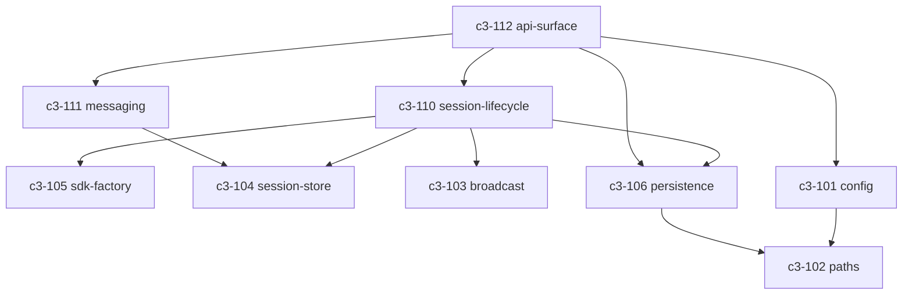

# Server

## Goal

Bridge web clients to Claude Agent SDK via HTTP + WebSocket API.

## Responsibilities

- Manage Claude SDK session lifecycle (create, resume, kill)
- Persist session metadata and messages to disk across restarts
- Broadcast SDK messages to connected WebSocket clients in real-time
- Forward permission prompts and user questions to the browser
- Expose REST API for session listing, message history, config, and workspace discovery
- Serve the built frontend static files

## Complexity Assessment

**Level:** moderate
**Why:** Multiple concerns (WebSocket management, SDK orchestration, permission delegation, filesystem persistence), stateful session management with in-memory + disk hybrid, async iterator-based message streaming.

## Components

| ID | Name | Category | Status | Goal Contribution |
|----|------|----------|--------|-------------------|
| c3-101 | [config](c3-101-config.md) | foundation | implemented | Provides application configuration to all other components |
| c3-102 | [paths](c3-102-paths.md) | foundation | implemented | Resolves filesystem paths for config and data storage |
| c3-103 | [broadcast](c3-103-broadcast.md) | foundation | implemented | Enables real-time message delivery to WebSocket clients |
| c3-104 | [session-store](c3-104-session-store.md) | foundation | implemented | Manages in-memory active session state |
| c3-105 | [sdk-factory](c3-105-sdk-factory.md) | foundation | implemented | Abstracts Claude SDK query creation |
| c3-106 | [persistence](c3-106-persistence.md) | foundation | implemented | Persists session metadata and messages to disk |
| c3-110 | [session-lifecycle](c3-110-session-lifecycle.md) | feature | implemented | Creates, resumes, and kills Claude sessions with SDK integration |
| c3-111 | [messaging](c3-111-messaging.md) | feature | implemented | Routes user messages and permission responses to active sessions |
| c3-112 | [api-surface](c3-112-api-surface.md) | feature | implemented | Exposes HTTP + WebSocket API for client communication |

## Internal Component Relationships

## Layer Constraints

**MUST:**
- Coordinate components within its boundary
- Define how context linkages are fulfilled internally
- Own its technology stack decisions (Hono, Bun, @pumped-fn/lite)

**MUST NOT:**
- Define system-wide policies (context responsibility)
- Implement business logic directly (component responsibility)
- Bypass refs for cross-cutting concerns
- Orchestrate other containers (context responsibility)
