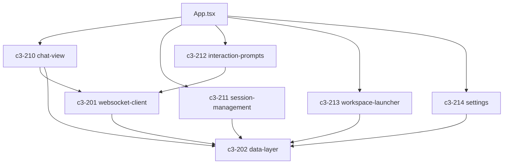

# Web

## Goal

Provide real-time browser UI for Claude session interaction.

## Responsibilities

- Maintain persistent WebSocket connection to server with auto-reconnect
- Render streaming Claude SDK messages in real-time
- Present permission prompts and user questions for interactive response
- Manage session navigation (create, select, resume, kill)
- Provide workspace discovery and preset launching
- Cache and synchronize server data via React Query

## Complexity Assessment

**Level:** moderate
**Why:** Real-time WebSocket state management, multiple message type renderers, permission/question interaction flows, session URL routing, design system constraints (Industrial Brutalist).

## Components

| ID | Name | Category | Status | Goal Contribution |
|----|------|----------|--------|-------------------|
| c3-201 | [websocket-client](c3-201-websocket-client.md) | foundation | implemented | Maintains WebSocket connection and routes server messages to UI state |
| c3-202 | [data-layer](c3-202-data-layer.md) | foundation | implemented | Provides data fetching and caching via React Query |
| c3-210 | [chat-view](c3-210-chat-view.md) | feature | implemented | Renders conversation messages in real-time |
| c3-211 | [session-management](c3-211-session-management.md) | feature | implemented | Navigates and manages multiple sessions |
| c3-212 | [interaction-prompts](c3-212-interaction-prompts.md) | feature | implemented | Handles SDK permission and question prompts in the browser |
| c3-213 | [workspace-launcher](c3-213-workspace-launcher.md) | feature | implemented | Launches new sessions from workspace presets |
| c3-214 | [settings](c3-214-settings.md) | feature | implemented | Configures application settings |

## Internal Component Relationships

## Layer Constraints

**MUST:**
- Coordinate components within its boundary
- Follow ref-industrial-brutalist design system for all UI
- Own its technology stack decisions (React 19, Vite, Tailwind CSS 4)

**MUST NOT:**
- Define system-wide policies (context responsibility)
- Implement business logic directly (component responsibility)
- Bypass refs for cross-cutting concerns
- Orchestrate other containers (context responsibility)
